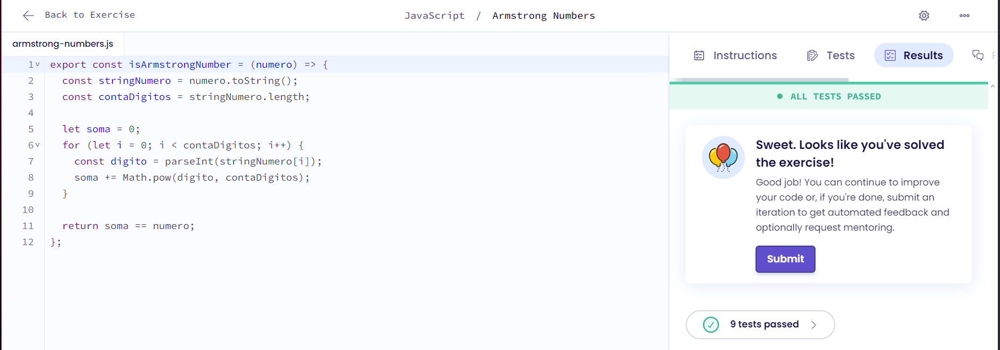

# Protein Translation

## Explicação
O código implementa a verificação de um Número de Armstrong, convertendo o número para string, contando seus dígitos e, através de um loop, calculando a soma de cada dígito elevado à potência do total de dígitos, comparando ao final se essa soma é igual ao número original, o que determina se é ou não um Número de Armstrong.

## Resultado
