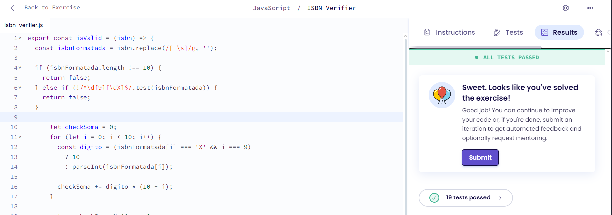

# Protein Translation

## Explicação
O código verifica a validade de um ISBN-10 através de uma série de etapas: primeiro, remove hífens e espaços do código ISBN; em seguida, confirma se tem exatamente 10 caracteres e se possui o formato correto (9 dígitos seguidos de um dígito ou 'X'); depois, calcula um checkSoma multiplicando cada dígito por um peso decrescente (10 a 1), tratando especialmente o 'X' como 10 no último dígito; por fim, verifica se o checkSoma é divisível por 11, o que determina se o ISBN é válido ou não, seguindo o algoritmo padrão de verificação de ISBN-10.

## Resultado
