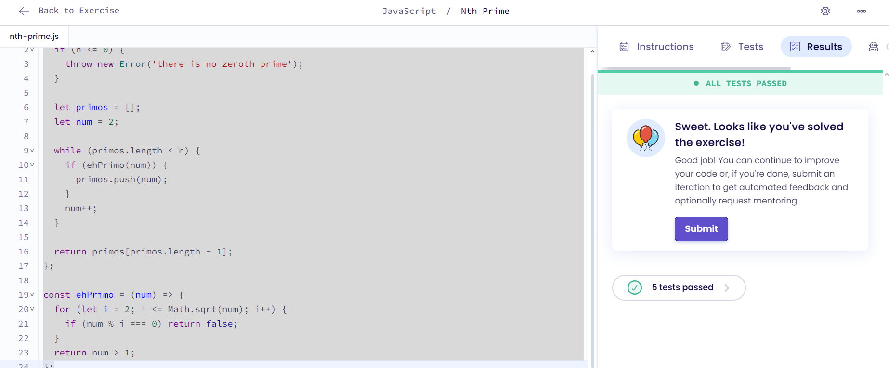

# Protein Translation

## Explicação
 A função prime(n) começa verificando se o número solicitado é válido, lançando um erro para valores não positivos. Em seguida, ela usa um loop que vai adicionando números primos a um array até que o comprimento desse array atinja o número n solicitado. A função auxiliar isPrime() verifica se um número é primo, testando divisibilidade apenas até a raiz quadrada do número, o que otimiza a verificação. Quando o array de primos atinge o tamanho desejado, a função retorna o último elemento, que é o n-ésimo primo.
 
## Resultado
