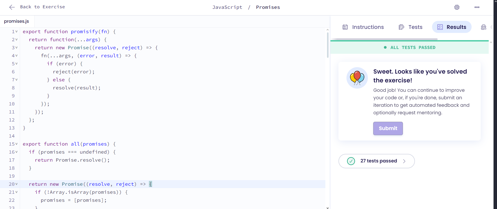

# Promises

## Explicação
1. promisify(fn):
    - Transforma funções de callback em funções que retornam Promise
    - Adiciona tratamento de erro/sucesso automaticamente
    - Simplifica código assíncrono

2. all(promises):
    - Resolve quando TODAS as promises são resolvidas
    - Retorna array com resultados na mesma ordem
    - Se alguma promise falhar, rejeita imediatamente
    - Trata casos especiais (undefined, não-array)
  
3. allSettled(promises):
   - Similar ao all(), mas não para na primeira falha
    - Sempre resolve, mostrando status de todas as promises
    - Retorna resultados mesmo com promises rejeitadas
    - Mantém a ordem original dos resultados
  
4. race(promises):
   - Resolve/rejeita com o primeiro resultado
    - Não espera outras promises completarem
    - Primeiro resultado (sucesso ou erro) "vence"
    - Trata casos especiais de entrada

5. any(promises):
    - Resolve com o primeiro resultado de sucesso
    - Só rejeita se TODAS as promises falharem
    - Diferente do race(), precisa de sucesso
    - Coleta erros se todas promises falharem
## Resultado
