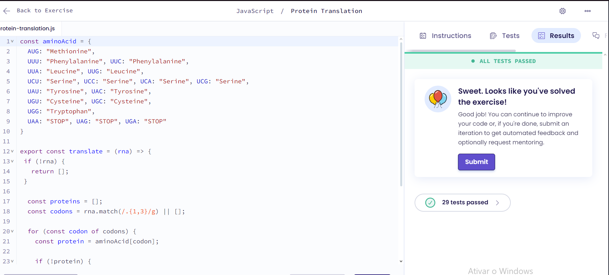

# Protein Translation

## Explicação
O código traduz uma sequência de RNA em proteínas, usando um dicionário (aminoAcid) que mapeia códons para proteínas. A função translate divide o RNA em códons, consulta cada códon no dicionário, valida a sequência e para quando encontra um códon de parada, retornando um array com as proteínas traduzidas.

## Resultado
